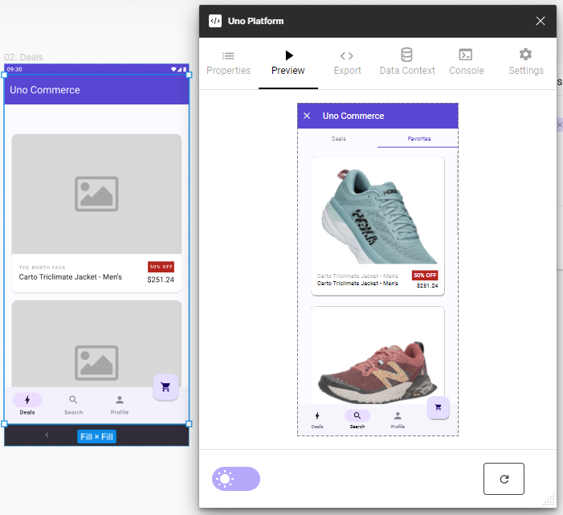

# Preview Tab

## Using the Preview Tab

The Preview tab is a powerful tool to troubleshoot your design and spot issues before handoff

 

### Preview notes

- Preview is dynamic, you can type into TextInputs, press buttons, and scroll through your design;
- You can even use mock data to better test out your design [Carl content please];
- Proper XAML generation depends on usage of the proper templates and components, please read the [New design guidelines](../designers/starting-new-design.md) before starting a new project;
- Contextual controls at the bottom of the tab allow you to: set view type, refresh view, export XAML and copy XAML to pasteboard;
- View type allows you to **[Carl content please]**;
- Preview does not allow navigation click through at the moment;
- Placed images are not rendered but represented with place holder images of the corresponding dimensions, you can reset the source of these images via… **[Carl content please]**;
- Primitive shapes are not currently supported in preview.

### Steps to use Preview tab

1. Select the page or component you wish to preview;
2. From the *Plugins* menu select *Uno Platform*;
3. Click the *Preview* tab (second one from the left);
4. Click the *Refresh* button at the bottom of the tab.

