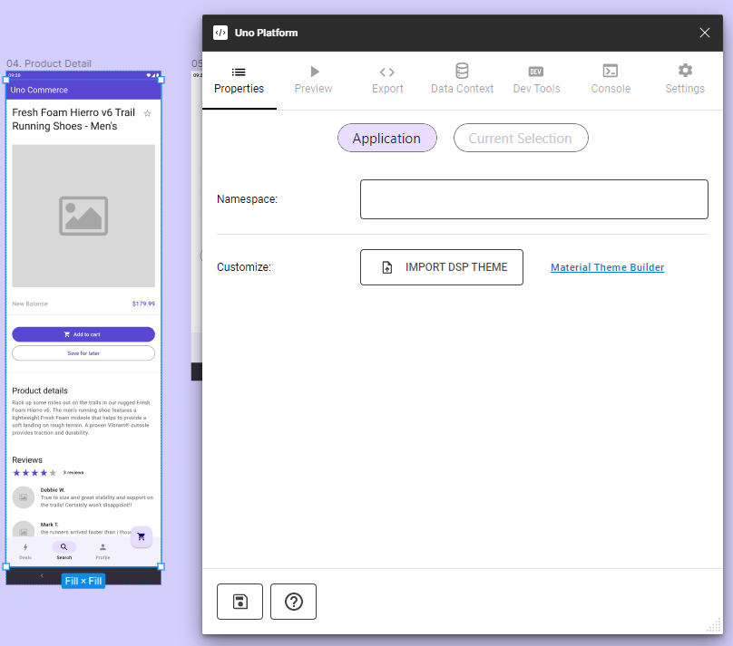

# Properties Tab in Uno Figma Plugin

## Overview

The Properties tab in the Uno Figma Plugin is a crucial feature for developers, allowing you to set metadata on Figma components. This metadata is instrumental in driving the generation of XAML code and can be used to establish bindings when the Bindings toggle is enabled in the settings tab.

### Key Features of the Properties Tab

#### Application
- **Namespaces Configuration**: Set application, views, and styles sub-namespaces.
- **Theme Customization**: Import and override theme packages. (See [DSP Import](../designers/dsp-import.md))

#### Selection (current selection)
- **Content**: Define bindings for the selected component instance.
- **Mode**: Choose between Static and Reactive modes for data handling.
- **Page Name**: Assign a custom name to the exported page.
- **Type**: Set behaviors like Page, UserControl, ListView, and Items Repeater to a frame. (only enabled when a frame is selected)
- **Custom Component Settings**: Manage properties for custom components.

> [!NOTE]
> The saving to document is automatic. It's done when the focus is changing from one field to the other.

### Detailed Explanation of Properties

#### Content Field and Binding

- Format for binding: `{BindingExpression}`. Example: `{Name}` in a Text Element translates to `<TextBlock Text="{Binding Name}" />` in XAML.

#### Mode Selection

- *Static Mode*: Data is present directly in the DataContext of the generated page.
- *Reactive Mode*: Utilizes `Feeds` of Uno.Extensions.Reactive to manage content availability.

  > [!NOTE]
  > In Reactive mode, `<FeedView>` is included in the exported XAML (not in preview) when the corresponding setting is enabled.

#### Type Assignment for Frames

- Assigning User Control, ListView, or Items Repeater behaviors affects both preview and exported XAML.
- AutoLayout orientation determines the layout type for ItemsRepeater.

  > [!NOTE]
  > Scrolling features for frames are set in the Prototype tab of Figma.

#### Custom Component Integration

- For detailed guidance on custom components, see [Custom Components](custom-components.md).

#### Namespace and Theme Management

- Define application-specific namespaces for organized code structuring.
- Override theme packages for tailored UI designs.

### Using the Properties Tab

1. **Select a Page or Component**: Choose the element for property assignment.
2. **Open Uno Plugin**: From Figma's Plugins menu, select Uno Platform.
3. **Access Properties Tab**: Jus select the Properties Tab at the tab bar.
4. **Enter Property Changes**: Modify the properties as needed.
5. **Save Changes**: Click the Save button at the bottom of the tab.
6. **Preview Changes**: Optionally, review the changes in Preview or Export tabs.

 
 

> [!NOTE]
> For specific component properties, refer to the individual component documentation within the plugin.

By leveraging the Properties tab effectively, developers can ensure that their Figma designs translate accurately into XAML code, maintaining design integrity and simplifying the development process.
