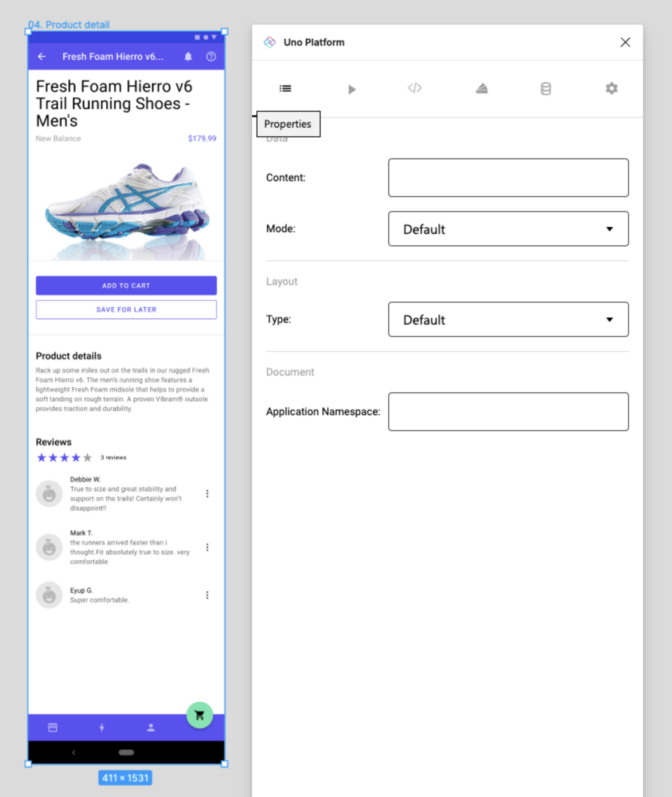

# Properties Tab

## Using the Properties Tab

Properties tab allows you to set metadata on Figma components used to drive to XAML generation.

It could also be used to set bindings to a component that can be used when the *Bindings* is toggled to ON in the settings tab.

> [!NOTE]
> Any changes in the properties tab must be saved, via the button at the bottom of the tab, to take effect.

### Properties notes

- *Content Field* allows to set Bindings for the selected component instance.
  > [!NOTE]
  > The format for the binding is `{BindingExpression}`. For example, setting the value `{Name}` on a Text Element in Figma will be translated into XAML like this:
  > ``` xml
  > <TextBlock Text="{Binding Name}" />
  > ```

- Mode:

  - *Default* mode: this means the data will be present directly in the DataContext of the generated page;

  - *Reactive* mode: this means the `Feeds` of Uno.Extensions.Reactive will be used to manage the availability of the content.

    > [!NOTE]
    > When using _Reactive_ mode, the `<FeedView>` component will be present in exported XAML, but never in the preview.
    >
    > The corresponding setting must be turned on for this generation to contains the FeedView control.

- *Layout type* allows you to assign List, Scrollable and Group behaviours to components;

- *Application Namespace*: this property is used to prefix the _namespace_ in the generated XAML.

- Refer to Individual component documentation for their properties settings in the plugin.

### Steps to use the Properties tab

1. Select the page or component you wish to assign properties to;
2. From the *Plugins* menu select *Uno Platform*;
3. Click the Properties tab (first one from the left);
4. Input changes;
5. Click the save button at the bottom of the tab;
6. (Optional) To preview the effects in the Preview or XAML tabs by clicking the desired tab and clicking the *Refresh* button at the bottom of the tab.

 

