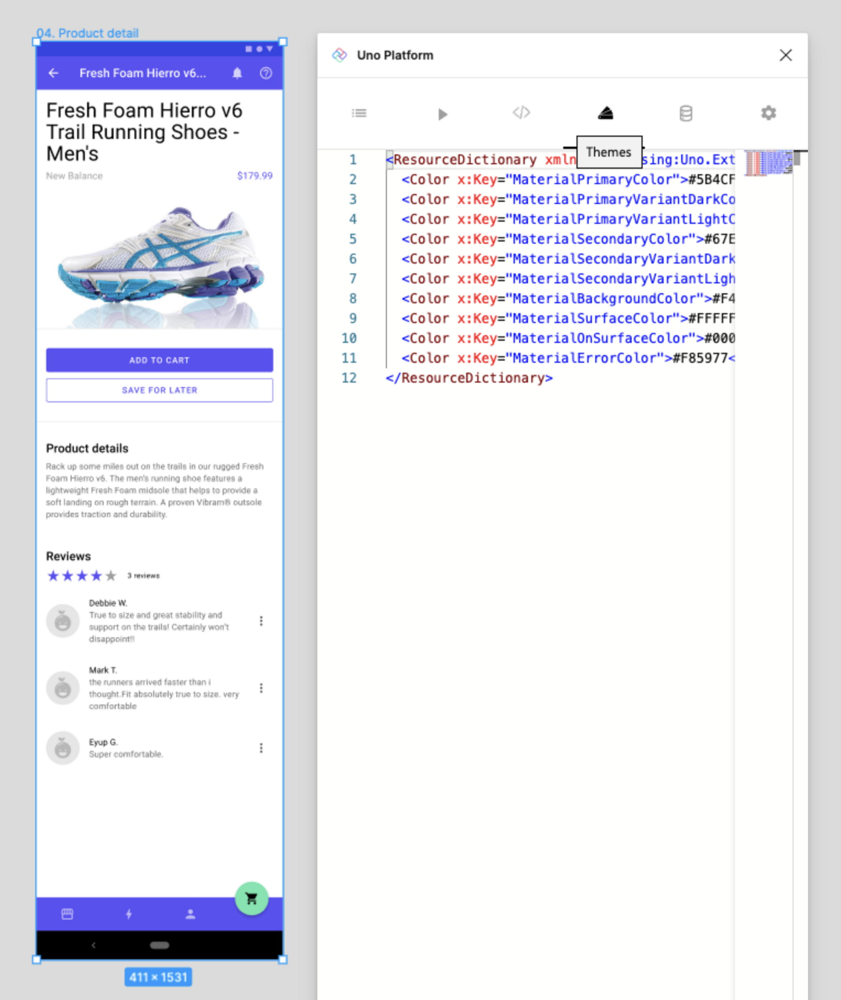

# Themes Tab

The *themes tab* contain the generated equivalent of defined colors in the Figma document.

> [!WARNING]
>
> This features will only work if the document has been created by duplicating the [Uno Toolkit](../designers/starting-new-design.md) document.

### Themes Feature

The content of this tab is used to set the [Uno Themes Custom Color Palette](https://platform.uno/docs/articles/external/uno.themes/doc/getting-started.html#customize-color-palette) for the application.

## Steps to use Themes tab

1. From the *Plugins* menu select *Uno Platform*;
3. Click the *Themes* tab (fourth one from the left);
4. Copy the text there into your _Color Override_ file of your application, as documented in the *Uno Themes* documentation.

