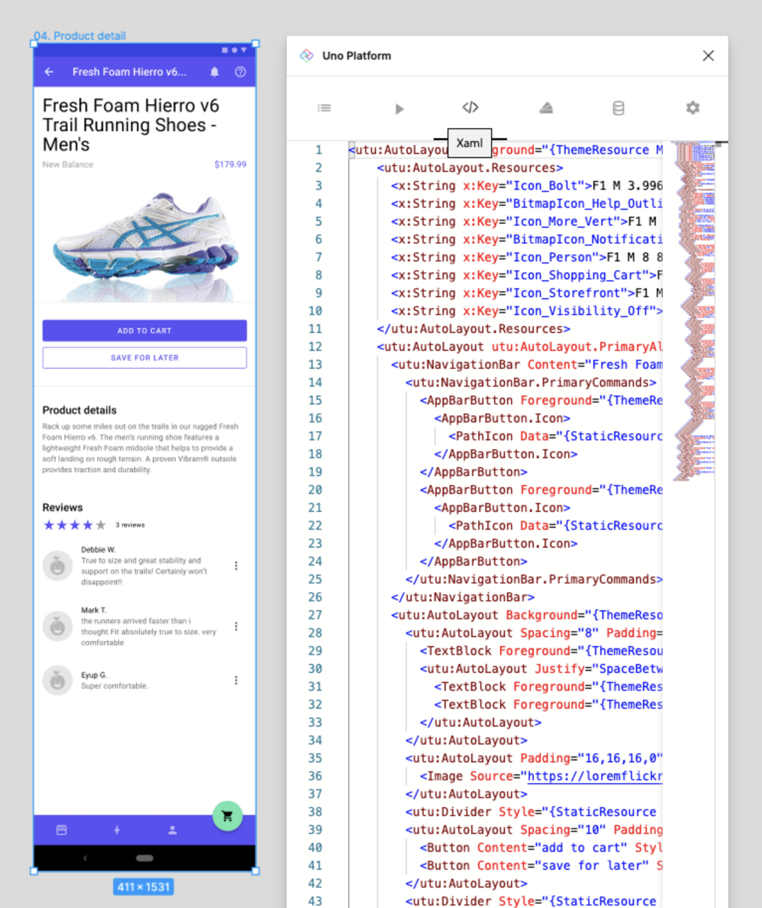

# XAML Tab

## Using the XAML Tab

The XAML tab is another powerful tool to edit and troubleshoot the design before handoff to developers.

It is possible experiment changes to generated XAML. By clicking the _Render_ button, the XAML won't be refreshed from the document, but only the preview will be re-rendered from the updated XAML. Beware that clicking _Refresh_ will discard all the changes, and replace the XAML with a new one from the Figma document.

> [!NOTE]
> Proper XAML generation depends on usage of the proper templates and components, please read the [New design guidelines](../designers/starting-new-design.md) before starting a new project;

### Steps to Use XAML Tab

1. Select the page or component to inspect or edit;
2. From Figma's *Plugins* menu select *Uno Platform*;
3. Click the *XAML* tab (third one from the left);
4. Click the *Refresh* button at the bottom of the tab.
5. Optional: Edit XAML in the plugin and click *Render* to view your changes.

