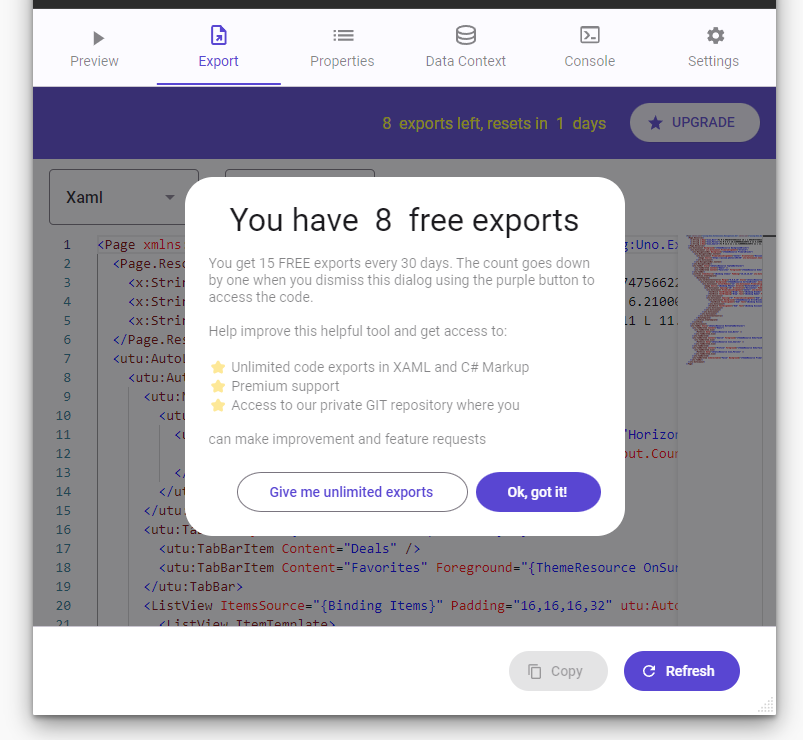

# Figma Plugin - Subscription Plans

The Uno Platform Figma plugin is initially available for free, providing users with access to all its features on both the web and desktop versions of Figma.

To better understand the distinctions between the free and paid versions, consider the following:

## Features

### Free Version:

- Access to all features of the plugin.
- Code export limited to 15 times per month.
- Community support

### Paid Version:

- Full access to all plugin features
- Unlimited code exports
- Professional Support

## Limitations of the Free Version

While the free version allows users to utilize all plugin features, the number of code exports is capped at 15 per 30 days. This means users can export up to 15 different "screens" within that period. Notably, there is no limit on the number of exports for the same selection. In essence, users can export the same screen an unlimited number of times as long as the selection remains unchanged.

Importantly, there is no restriction on the number of generations; only code exports are subject to limitations. This approach facilitates extensive testing and adjustments before the final export.

When the user generates a preview and accesses the Export Tab, a notification will overlay the generated code, indicating the current status of free exports:

Upon accepting the terms, the export count will decrement by one, granting the user permission to proceed with exporting the generated code. This intuitive process ensures transparency and control over the utilization of free exports.

## Subscription Plan Overview

The Uno Platform Figma plugin seamlessly integrates with the Figma Purchase System. Users can subscribe to the plugin plan directly from the Figma Community website or follow a guided process within the plugin itself. Subscriptions are linked to the user's Figma account and are applicable across any device connected to that account. This ensures a convenient and consistent experience for subscribers.
